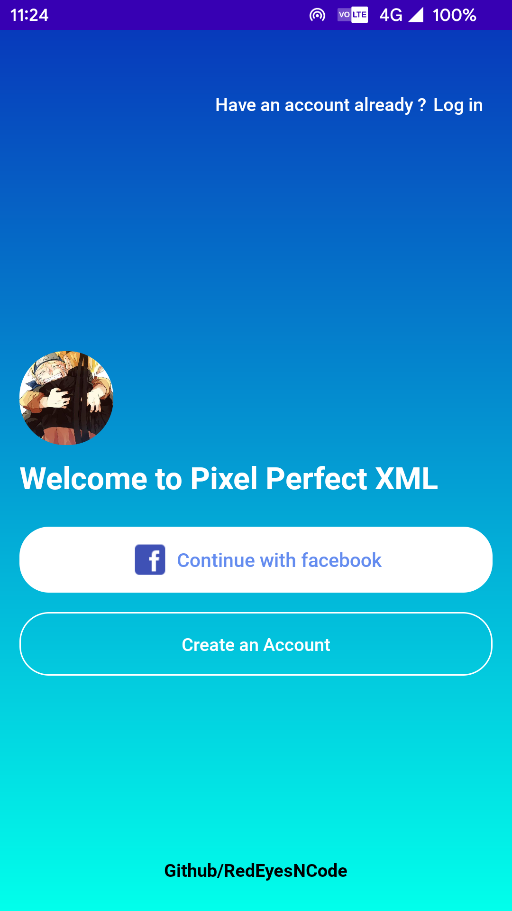

# PixelPerfectXML
This Repo recalls the ways to acheive Pixel-Perfect UI in the XML of Android.

-This Repository will contain different showcasing different UI's flow if different apps like Social Media, Food Apps and More..
<table>
    <tr>
    <td>Pixel Perfect XML</td>
    </tr>
    <tr>
    <td></td>
    </tr>
</table>